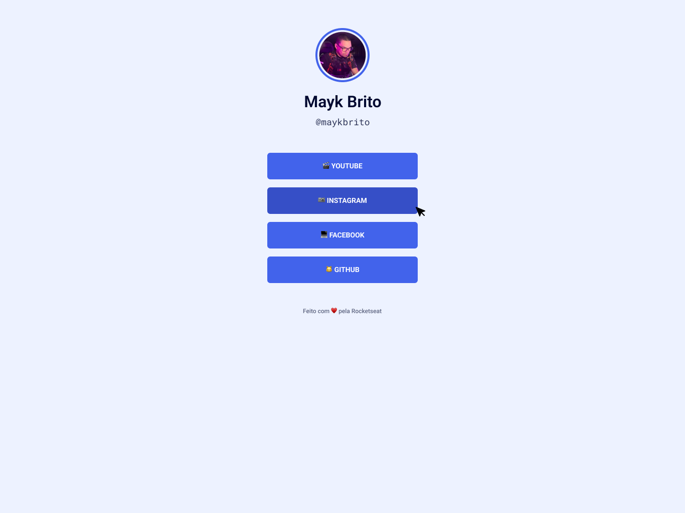

# Maratona Explorer 2.0

<h1 align="center">

</h1>

  <a href="#-tecnologias">Tecnologias</a>&nbsp;&nbsp;&nbsp;|&nbsp;&nbsp;&nbsp;
  <a href="#-projeto">Projeto</a>&nbsp;&nbsp;&nbsp;|&nbsp;&nbsp;&nbsp;
  <a href="#-layout">Layout</a>&nbsp;&nbsp;&nbsp;|&nbsp;&nbsp;&nbsp; 

 
 

## 🚀 Tecnologias

Esse projeto foi desenvolvido com as seguintes tecnologias:

- Html
- Css

## 💻 Projeto Rocketseat Redes Sociais  

O Rede Sociais é uma aplicação para ter acesso a todos os links da rede sociais do usuário.

## 🔖 Layout

Você pode visualizar o layout do projeto através [desse link](https://www.figma.com/file/j8Fe7AGabn3hX2OCVLTB3i/Rocket-Links---Maratona-Explorer-2.0-(Community)). É necessário ter conta no [Figma](https://figma.com) para acessá-lo.

## 👨🏻‍💻 Link para o visualizar o site

<a href="https://expore.vercel.app/">Site</a>
